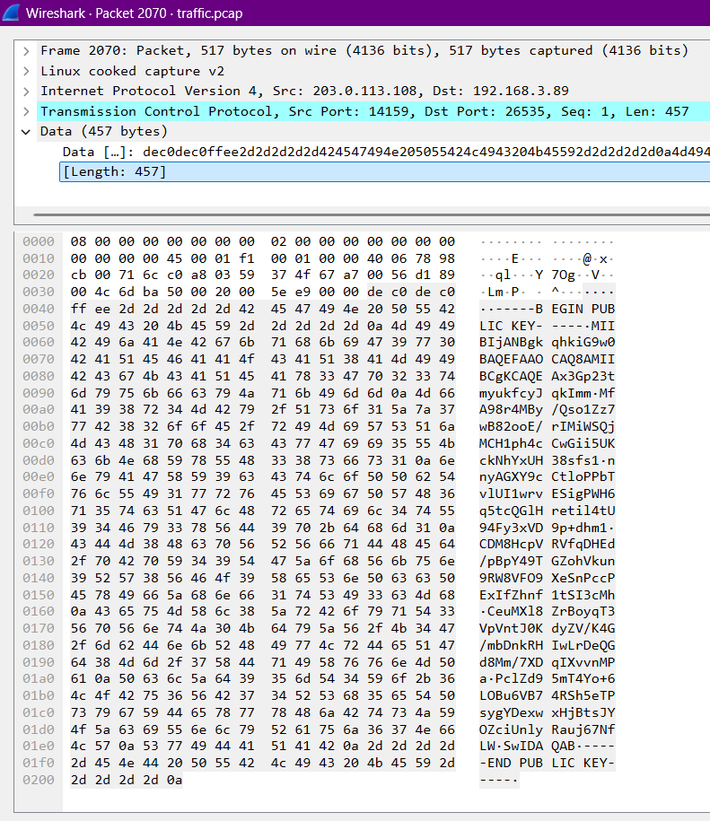
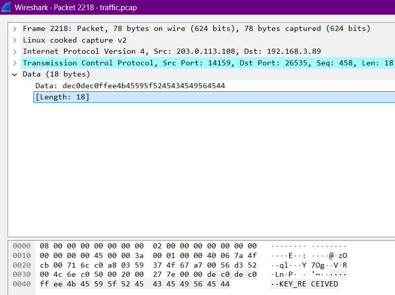
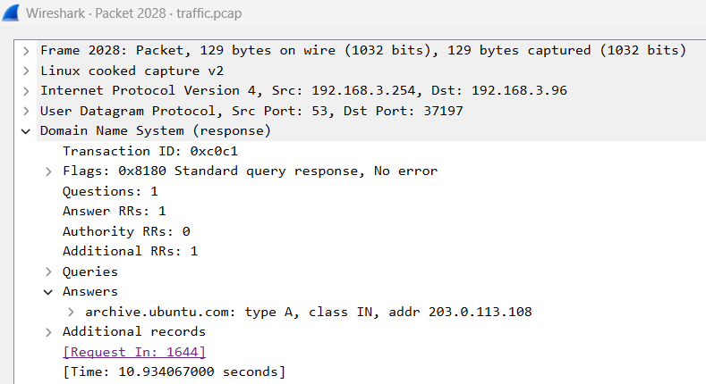
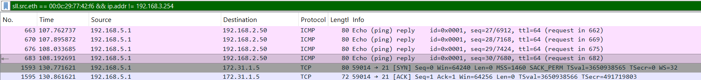
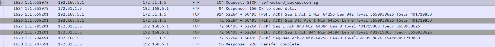

# Task 2 - The hunt continues - (Network Forensics)
### Date started: September 24, 2025
### Date completed: September 28, 2025
### Provided Materials
- PCAP file (traffic.pcap)
### Objective
Analyze the provided PCAP file and identify malicious activity. Submit all the IP addresses that are associated with the malicious device.
### Analysis
I began by opening the provided PCAP file in Wireshark, which contained over 2,000 captured packets. Compared to Task 1, the dataset was noticeably larger and noisier. My first reviews consisted of scrolling through the packet entries from beginning to end to build context and identify potential malicious activity. Most traffic appeared to be legitimate, which added significant background noise.

Early in the review, suspicious TCP communication was observed between an endpoint within the internal network (`192.168.3.89`) and an external server (`203.0.113.108`).


Something immediately stood out: none of the TCP flags were set in these packets. This behavior is highly unusual for standard TCP communication. Wireshark filtering using `tcp.flags == 0` was used to isolate these packets for further analysis.

Closer inspection revealed that the first packet in this exchange contained an RSA public key sent in plaintext from the external server to the internal endpoint.



Subsequent packets consisted of unreadable random or encrypted data. Notably, the server later sent a plaintext status message of `KEY_RECEIVED` back to the endpoint.



At this stage, it appeared likely that these IP addresses were the answer, so `203.0.113.108` and `192.168.3.89` were submitted for validation. The response indicated this was incorrect. Although the traffic was clearly suspicious, the full scope of the malicious activity had not yet been identified. 
> Note: This communication becomes relevant again in Task 5, but is not central to the current investigation.

To determine how the internal endpoint was redirected to the external server, I pivoted to supporting activity that could explain the connection. One idea was that a DNS server within the internal network had been compromised. Filtering on DNS traffic revealed a suspicious DNS response originating from `192.168.3.254`.



This DNS response falsely claimed that the legitimate domain `archive.ubuntu.net` resolved to the malicious external IP address `203.0.113.108`.

Based on this evidence, I concluded that the endpoint at `192.168.3.89` attempted to access `archive.ubuntu.com` but received the malicious DNS response from `192.168.3.254`. As a result, the endpoint established a connection to the attacker-controlled server, explaining the strange TCP communication observed earlier.

With one IP address associated with the malicious device identified (`192.168.3.254`), the next step was to determine whether additional IP addresses were assigned to the same device. Traffic was filtered by MAC address (`00:0c:29:77:42:f6`) using the following Wireshark filter: `sll.src.eth == 00:0c:29:77:42:f6 && ip.addr != 192.168.3.254`. This revealed a second IP address associated with the same device: `192.168.5.1`.



Submitting `192.168.3.254` and `192.168.5.1` resulted in partial validation, with feedback indicating that additional IP addresses were still missing. Further review of the traffic revealed FTP traffic between the IP `192.168.5.1` and an internal FTP server at `172.31.1.5`.



These sessions transmitted a file named `router3_backup.config` in plaintext. This strongly suggested that the malicious device was a compromised router within the internal network. The configuration file contents were extracted from the packet capture into a text file for easier analysis:
```
config interface 'loopback'
	option device 'lo'
	option proto 'static'
	option ipaddr '127.5.3.3'
	option netmask '255.0.0.0'

[...]

config interface 'lan'
	option device 'br-lan'
	option proto 'static'
	option ipaddr '192.168.3.254'
	option netmask '255.255.255.0'
	option ip6assign '60'

config interface 'to_openwrt2'
	option device 'eth1'
	option proto 'static'
	list ipaddr '192.168.5.1/28'

[...]
```
Reviewing the router configuration revealed three statically assigned IP addresses across different interfaces. The missing IP address was identified as the loopback address `127.5.3.3`.
### Result
The following IP addresses were associated with the malicious device and submitted as the solution for Task 2:
- `192.168.3.254`
- `192.168.5.1`
- `127.5.3.3`