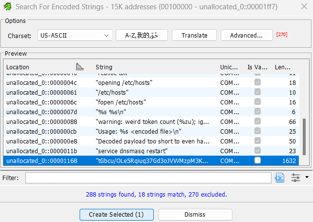

# Task 3 - Digging deeper - (Reverse Engineering)
### Date started: September 28, 2025
### Date completed: October 12, 2025
### Provided Materials
- Memory dump (memory.dump.gz)
- Metadata (System.map.br)
- Kernel image (vmlinux.xz)
### Objective
Scour the device's memory dump and identify anomalous or malicious activity to find out what's going on. Submit a list of malicious IPs and domains.
### Analysis
Task 3 shifted focus from disk and network artifacts to live memory analysis. To understand the purpose of the provided materials, each file was examined individually. This led to the use of Volatility, a popular memory forensics framework.

Volatility was installed in a Linux environment using Python. The first step was understanding the operating environment captured in the memory dump. Using Volatility’s `banners` plugin, I identified the system as an OpenWRT-based Linux device, consistent with a network router rather than a traditional server or workstation.

Since Volatility requires matching kernel symbols for Linux memory analysis, the memory dump could not be analyzed immediately. To resolve this, I used `dwarf2json` to generate a Volatility-compatible symbol file from the provided `System.map.br` and `vmlinux` files.
```bash
$ ./dwarf2json linux --elf vmlinux --system-map System.map > symbols.json
```

With symbols in place, I began by exploring available Linux plugins and performing high-level enumeration. The initial focus was on process analysis, similar in concept to reviewing output from commands such as `ps` or `top` on a live system. Upon enumerating running processes using Volatility's `linux.psaux.PsAux` plugin, an anomalous process with an unusual name of `4` and PID of 1552 was revealed.
```bash
$ vol -f memory.dump linux.psaux.PsAux
Volatility 3 Framework 2.26.2
Progress:  100.00		Stacking attempts finished            
PID	    PPID	COMM	ARGS

[...]
1552	515	    4	    /bin/hosts-refresh /proc/self/fd/5
[...]
```

The process was associated with a non-standard program in `/bin` named `hosts-refresh`, which read a file as its parameter. The referenced file did not appear to exist as a persistent artifact within the memory dump. To better understand how the program functioned, Volatility's `linux.elfs.Elfs` plugin located and dumped the binaries and memory contents related to the suspicious process.
```bash
$ vol -f memory.dump linux.elfs.Elfs --pid 1552 --dump
Volatility 3 Framework 2.26.2
Progress:  100.00		Stacking attempts finished            
PID	    Process	   Start	        End	            File Path	               File Output

1552	4	       0x562c903f4000	0x562c903f5000	/memfd:x (deleted)	pid.1552.4.0x562c903f4000.dmp
1552	4	       0x7fc621165000	0x7fc621179000	/lib/libc.so	pid.1552.4.0x7fc621165000.dmp
1552	4	       0x7ffda532d000	0x7ffda532e000	[vdso]	pid.1552.4.0x7ffda532d000.dmp
```

The process was running as a **memory‑backed executable** (`/memfd:x (deleted)`), indicating that it had been executed directly from memory without a persistent file on disk. This behavior is consistent with fileless malware execution. With the in‑memory ELF successfully extracted, the next step was to determine what the process was doing and how it modified the system. The respective binary was loaded into **Ghidra** for reverse engineering. Initial inspection confirmed that the program was written in C and utilized `libc`. A quick review of the decompiled code revealed logic responsible for opening and appending data to `/etc/hosts`:
```c
puts("opening /etc/hosts");
__stream = fopen("/etc/hosts","a");
```

This immediately aligned with the program name (`hosts-refresh`) and suggested intentional manipulation of local hostname resolution. Attempts were made to extract `/etc/hosts` directly from the memory dump using the Volatility plugin `linux.pagecache.InodePages`; however, the memory page containing the file was corrupted, preventing reliable recovery.
```
ERROR    volatility3.framework.symbols.linux: Invalid cached page, aborting
ERROR    volatility3.plugins.linux.pagecache: Error dumping cached pages
WARNING  volatility3.plugins.linux.pagecache: Page cache is corrupt
```

Further examination of the decompiled `main()` showed that the program expected a single input file, read entirely into memory, and processed through multiple decoding stages before being parsed. Rather than using standard library routines, the binary implemented its own decoding logic to evade quick detection.

Rather than documenting every low‑level detail of the decompiled output, a representative high‑level reconstruction of the program’s logic for `main()` is provided below.
```c
int main(int argc,undefined8 *argv)

{
  int iVar1;
  size_t base64_length;
  ulong decoded_payload_length;
  void *base64_buffer;
  uint *decoded_payload;
  uint *start_of_buffer;
  size_t buffer_length;
  long local_10;
  
  if (argc == 2) {
    build_base64_lookup_table();
    base64_length = 0;
    base64_buffer = read_base64_into_memory((char *)argv[1],&base64_length);
    if (base64_buffer == (void *)0x0) {
      iVar1 = 1;
    }
    else {
      decoded_payload_length = 0;
      decoded_payload =
           (uint *)custom_base64_decode
                             ((long)base64_buffer,base64_length,(long *)&decoded_payload_length);
      free(base64_buffer);
      if (decoded_payload == (uint *)0x0) {
        iVar1 = 1;
      }
      else if (decoded_payload_length < 4) {
        fwrite("Decoded payload too short to even have the key...\n",1,0x32,(FILE *)0x0);
        free(decoded_payload);
        iVar1 = 1;
      }
      else {
        // First 4 bytes act as rolling XOR seed; remaining bytes are payload
        start_of_buffer = decoded_payload + 1;
        buffer_length = decoded_payload_length - 4;
        custom_xor_decode((long)start_of_buffer,buffer_length,*decoded_payload);
        append_hosts_from_decoded_payload(start_of_buffer,buffer_length);
        system("service dnsmasq restart");
        free(decoded_payload);
        handle_interrupts();
        iVar1 = 0;
      }
    }
  }
  else {
    fprintf((FILE *)0x0,"Usage: %s <encoded file>\n",*argv);
    iVar1 = 1;
  }
  return iVar1;
}
```

At a high level, the program performs the following steps:
- Initializes a custom character lookup table for Base64 decoding rather than relying on standard libraries
- Reads a file containing base64-encoded text into memory
- Decodes the contents using a custom Base64 routine to retrieve the first-stage payload
- Applies a secondary XOR‑based decoding stage to obtain the original text
- Parses the decoded text into tokenized host entries, structured as `IP FULLY_QUALIFIED_DOMAIN_NAME`
- Appends the results to `/etc/hosts`
- Restarts `dnsmasq` to apply changes

### Result
I reimplemented all the decoding logic in C and executed it against the recovered base64 input string. Because the payload was initially loaded into memory, the encoded string could be recovered directly from the Volatility dumps. The same string was also embedded near the end of the extracted ELF and confirmed via Ghidra's `Search For Encoded Strings` utility.



Instead of modifying system files, the reconstructed program printed the decoded output to standard output. This output revealed the list of malicious IP addresses and domains that would have been written to `/etc/hosts`.
```
203.0.113.71 pypi.io
203.0.113.49 cache.nixos.org
203.0.113.71 files.pythonhosted.org
203.0.113.76 mirrors.opensuse.org
203.0.113.76 geo.mirror.pkgbuild.com
203.0.113.49 ports.ubuntu.com
203.0.113.49 us.archive.ubuntu.com
203.0.113.49 repo-default.voidlinux.org
203.0.113.49 archive.ubuntu.org
203.0.113.49 download.opensuse.org
203.0.113.49 repos.opensuse.org
203.0.113.76 mirrors.alpinelinux.org
203.0.113.49 archive.archlinux.org
203.0.113.49 security.ubuntu.org
203.0.113.76 mirror.rackspace.com
203.0.113.49 security.debian.org
203.0.113.49 download1.rpmfusion.org
203.0.113.49 security.ubuntu.com
203.0.113.49 packages.linuxmint.com
203.0.113.49 dl.rockylinux.org
203.0.113.49 ports.ubuntu.org
203.0.113.49 http.kali.org
203.0.113.76 xmirror.voidlinux.org
203.0.113.49 archive.ubuntu.com
203.0.113.49 distfiles.gentoo.org
203.0.113.76 mirrors.fedoraproject.org
203.0.113.76 mirrors.rpmfusion.org
203.0.113.49 repo.almalinux.org
203.0.113.71 pypi.org
203.0.113.49 deb.debian.org
203.0.113.49 ftp.us.debian.org
203.0.113.71 pypi.python.org
203.0.113.76 mirror.stream.centos.org
203.0.113.49 dl-cdn.alpinelinux.org
203.0.113.76 mirrors.rockylinux.org
203.0.113.49 dl.fedoraproject.org
203.0.113.76 mirrors.kernel.org
```

This was submitted as the solution to Task 3.