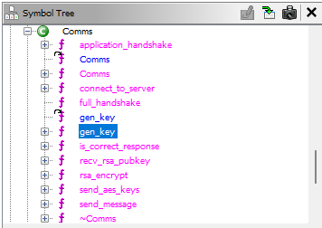
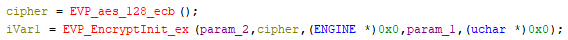
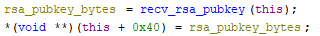
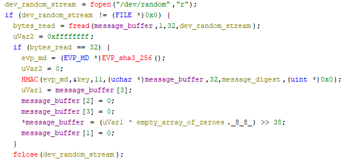
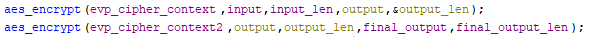
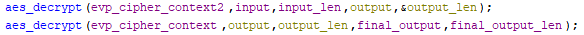

# Task 5 - Putting it all together - (Cryptanalysis)
### Date started: October 23, 2025
### Date completed: November 12, 2025
## Provided Materials
- None
## Objective
Utilizing evidence gathered across all prior tasks, identify and recover the full URL of the adversary’s command-and-control server.
## Analysis
Task 5 introduced no new material for analysis. Instead, it required correlating evidence and observations gathered throughout previous tasks to better understand the malware’s communication protocol and overall behavior. 

Building on the results from Task 4, I returned to the extracted payload and focused on its network communication logic. The dropped payload contains a `Comms` class responsible for all client–server communication. Analysis in Ghidra showed that this class implements custom encryption and message-handling routines, while relying on the OpenSSL library for cryptographic primitives.
### The `Comms` Class and Encryption Scheme
Within the `Comms` class, member functions retained their original names:



Further inspection revealed that the payload uses **AES-128 in ECB mode**, implemented via OpenSSL, for encrypting application-level messages.



The AES keys are generated during construction of the `Comms` object and are later exchanged during a handshake process with the remote server.
### Correlating Network Traffic with Code Behavior
At this stage, I revisited the packet capture provided in Task 2 and opened it in Wireshark, filtering traffic between the infected endpoint and the attacker-controlled server. The observed packet sequence aligned closely with the logic implemented in the `full_handshake` function from `Comms`.

The full handshake proceeds as follows:
1. **RSA public key exchange:**
    The server sends an RSA public key to the client in plaintext, which is stored internally within the `Comms` object.
    
    
    
    This exchange is visible directly in the packet capture.
    
    
    
2. **AES key exchange:**
	The client encrypts the generated AES keys using the received RSA public key. These encrypted AES keys are then sent back to the server in one message.
    
3. **Handshake confirmation:**  
	The server responds with a plaintext message containing the string `KEY_RECEIVED`, confirming successful receipt of the AES keys.
    
4. **Application handshake (AES-encrypted):**
    Following the key exchange, both sides transition to encrypted communication:
    - The client sends an AES-encrypted message beginning with the marker `0xdec0dec0ffee`, followed by the string `REQCONN`.
    - The server replies with an AES-encrypted message beginning with the same marker, followed by `REQCONN_OK`.

Two more AES-encrypted messages were sent and captured, but their plaintext contents were initially unknown. Notably, all encrypted application-level messages begin with the byte sequence `0xdec0dec0ffee`, which appears to function as a message header.
### Limitations and Further Investigation
Because the RSA private key is not available, it is not possible to directly decrypt the AES keys exchanged during the handshake from the packet capture alone. As a result, the contents of subsequent AES-encrypted messages cannot be recovered statically.

To better understand how these keys are generated, I shifted focus back to the payload and began analyzing the `Comms::gen_key` routine, which is invoked during object construction. This function is responsible for generating the AES session keys and is critical to understanding how the encrypted traffic could be recovered under controlled execution.
### Key Generation Weakness
Further analysis of the `Comms::gen_key` routine showed that actual key material generation occurs within the nested `generate_key` function.



While the function initially reads 32 bytes of random data from `/dev/random`, the majority of this entropy is intentionally discarded. After computing an HMAC whose output is never used, the function explicitly zeroes most of the buffer and right-shifts the remaining data by 38 bits. As a result, the generated AES keys contain only **26 bits of effective entropy** (or 2^26 = 67,108,864 possible keys), with the remaining bits set to zero. This severely weakens the cryptographic strength of the session keys, making them trivial to brute-force using modern hardware.

To get a better idea of how the AES keys are structured in memory, I wrote a C++ program to dynamically load and run the `Comms` class constructor from the payload file. Ghidra was used to find the position of one of the keys in the object, which is printed out in this program.
```cpp
#include <dlfcn.h>
#include <cstdio>
#include <cstdlib>
#include <cstring>
#include <vector>
#include <iostream>

int main() {
    const char *libpath = "./libtask4.so";
    // The symbol names were retrieved from Ghidra
    const char *comms_constructor_symbol = "_ZN5CommsC2Ev";
    const char *comms_destructor_symbol = "_ZN5CommsD2Ev";

    void *h = dlopen(libpath, RTLD_NOW | RTLD_LOCAL);
    if (!h) {
        fprintf(stderr, "dlopen failed: %s\n", dlerror());
        return 1;
    }

    // Low-level function pointers: constructor and destructor are non-static member functions called with 'this' in the first argument register (on x86_64).
    using constructor_function = void(*)(void*);
    using destructor_function = void(*)(void*);

    dlerror(); // clear errors
    void *sym = dlsym(h, comms_constructor_symbol);
    const char *err = dlerror();
    if (err) {
        fprintf(stderr, "dlsym constructor failed for %s: %s\n", comms_constructor_symbol, err);
        dlclose(h);
        return 1;
    }
    constructor_function constructor_call = sym ? reinterpret_cast<constructor_function>(sym) : nullptr;

    dlerror();
    void *sym2 = dlsym(h, comms_destructor_symbol);
    err = dlerror();
    if (err) {
        fprintf(stderr, "dlsym destructor failed for %s: %s\n", comms_destructor_symbol, err);
    }
    destructor_function deconstructor_call = sym2 ? reinterpret_cast<destructor_function>(sym2) : nullptr;

    // Allocate a big buffer on the heap to reduce chance of size mismatch stomping the stack
    size_t bufsize = 8192;
    void *buf = malloc(bufsize);
    if (!buf) {
        perror("malloc");
        dlclose(h);
        return 1;
    }
    // Initialize the buffer with placeholder bytes
    memset(buf, 0xAA, bufsize);

	if (!constructor_call) {
	    fprintf(stderr, "Constructor symbol is null\n");
	    free(buf);
	    dlclose(h);
	    return 1;
	}
    
    constructor_call(buf);
    unsigned char* base = static_cast<unsigned char*>(buf);
    // The key's location in the Comms object was retrieved from Ghidra's decompilation
    unsigned char* aes_key = base + 0x14;
    printf("[*] AES key: ");
    for (int i = 0; i < 16; i++) {
	    printf("%02x ", aes_key[i]); // print each byte in hex
    }
    printf("\n");
    
    if (deconstructor_call) {
	    deconstructor_call(buf);
	}
	free(buf);
	return 0;
}
```

After running the program, the below is printed:
```
[*] AES key: D3 7A 36 02 00 00 00 00 00 00 00 00 00 00 00 00
```

After running the key generation a couple times, the last 12 bytes are always zeroed out while the leading four appear to be random. By slightly modifying the program to generate 100,000 keys, the structure was identified. Each generated AES key follows the pattern `XX XX XX YY 00 00 00 00 00 00 00 00 00 00 00 00`, where only the first 26 bits vary: the first three bytes (`XX`) are fully random, the fourth byte (`YY`) is restricted to the range `0x00–0x03`, and the remaining twelve bytes are always zero.

This weakness becomes particularly significant when examining how the malware encrypts its network traffic, as the generated AES keys are used directly in the `send_message` routine.
### AES Usage and Double Encryption
Inspection of the `send_message` routine revealed that outbound messages are encrypted **twice** using AES-128 in ECB mode:
- Plaintext is encrypted with the first AES key
- The resulting ciphertext is encrypted again using a second AES key

	

Message decryption occurs in the reverse order:
- Ciphertext is decrypted with the second key
- The result is decrypted with the first key to recover the plaintext

	

Although double encryption might appear to add security, the extremely weak key generation combined with ECB mode negates any real cryptographic benefit.
### Meet-in-the-Middle Attack Feasibility
This construction makes the malware vulnerable to a meet-in-the-middle (MITM) attack. Rather than brute-forcing both AES keys independently (which would be inefficient), an attacker can:
- Encrypt a known plaintext block (16 bytes in size) with all possible values of the first key
- Decrypt the observed ciphertext block with all possible values of the second key
- Match the intermediate results to recover both keys efficiently
This approach reduces the effective attack complexity to a manageable level given the extremely low key entropy. As a result, the attack is feasible because the effective key space is small enough to allow full enumeration on modern hardware.
### Known Plaintext Identification
The packet capture provided sufficient known plaintext to enable this attack. All application-level messages begin with the fixed byte sequence: `dec0dec0ffee`. Additionally, during the application handshake phase, the malware sends a known 16-byte plaintext containing: `dec0dec0ffeeREQCONN_OK`. This plaintext appears in the second encrypted message captured in the PCAP, making it an ideal candidate for the MITM attack.
### Key Recovery and Message Decryption
Using this known plaintext and the weak key structure, I implemented a Python script to perform the meet-in-the-middle attack and recover both AES session keys. 
```python
from Crypto.Cipher import AES

ciphertext = b'\xc7\xe2\x31\xfb\x5a\x0b\xce\x06\x05\xd4\xa7\xac\x2b\xf8\x50\x0e\xe7\x59\x6e\xc4\xb2\xd6\xd0\xb6\xdc\x3f\x43\xed\x79\xc6\x36\x22\xfd\xb1\xad\x26\x1e\x3f\x9d\x90\x86\x7d\x72\x7c\xbb\xe9\x6d\x33'
target_block = ciphertext[:16] # First 16 bytes are our target block

# Generates the first four bytes of all possible AES keys with the pattern identified earlier
def loop_through_candidates():
    for i in range(0xFFFFFF+1):
        for j in range(4):
            result = (i << 8) | j
            yield result

# Generates a 16-byte AES key with the pattern identified earlier using a candidate value as the parameter
def gen_key(candidate):
    return candidate.to_bytes(4, 'big') + bytes(12)

def aes_encrypt_block(key16, block16):
    context = AES.new(key16, AES.MODE_ECB)
    return context.encrypt(block16)

def aes_decrypt_block(key16, block16):
    context = AES.new(key16, AES.MODE_ECB)
    return context.decrypt(block16)

# Note: This implementation trades memory for speed; optimized MITM variants could significantly reduce memory usage.
def main():
    intermediate_bytes = {} # A hash table stores the intermediate_bytes in memory for faster retrieval
    
	# Decrypt the target block with every possible key and store the results in the hash table
    for k in loop_through_candidates():
        key16 = gen_key(k)
        decrypted = aes_decrypt_block(key16, target_block)
        intermediate_bytes[decrypted.hex()] = k

    print("[!] Finished populating hash table...")
    print("[!] Finding a key match...")
    
    plaintext = b'\xde\xc0\xde\xc0\xff\xeeREQCONN_OK'
    # Encrypt the known plaintext block with every possible key and check if the hash table contains the result
    for k in loop_through_candidates():
        key16 = gen_key(k)
        encrypted = aes_encrypt_block(key16, plaintext)
        if encrypted.hex() in intermediate_bytes:
            k1 = intermediate_bytes[encrypted.hex()] # Retrieve the first key from the hash table
            k2 = k
            print("[!] Match found")
            print(f"[!] Key 1: {gen_key(k1)}")
            print(f"[!] Key 2: {gen_key(k2)}")
            return

    print("[-] No match found...")

if __name__ == '__main__':
    main()
```

After a few minutes, the script recovers the two AES keys:
```
[!] Finished populating hash table...
[!] Finding a key match...
[!] Match found
[!] Key 1: b'\xe3\xdc\xc1\x00\x00\x00\x00\x00\x00\x00\x00\x00\x00\x00\x00\x00'
[!] Key 2: b'\x893\xeb\x00\x00\x00\x00\x00\x00\x00\x00\x00\x00\x00\x00\x00'
```

With the correct keys identified, all four captured ciphertexts could be decrypted successfully:
```
b'\xde\xc0\xde\xc0\xff\xeeREQCONN\x03\x03\x03\xd7~En\xf9\x12\x90\xf5\xd1>\x87\xd8\x9e\xca\xf5\xd4'
b'\xde\xc0\xde\xc0\xff\xeeREQCONN_OK\x10\x10\x10\x10\x10\x10\x10\x10\x10\x10\x10\x10\x10\x10\x10\x10\xd7~En\xf9\x12\x90\xf5\xd1>\x87\xd8\x9e\xca\xf5\xd4'
b'\xde\xc0\xde\xc0\xff\xeeDATA REQUEST mattermost_url\x0f\x0f\x0f\x0f\x0f\x0f\x0f\x0f\x0f\x0f\x0f\x0f\x0f\x0f\x0f\xd7~En\xf9\x12\x90\xf5\xd1>\x87\xd8\x9e\xca\xf5\xd4'
b'\xde\xc0\xde\xc0\xff\xeehttps://198.51.100.166/mattermost/PdGi6ciWUPS6G\x0b\x0b\x0b\x0b\x0b\x0b\x0b\x0b\x0b\x0b\x0b\xd7~En\xf9\x12\x90\xf5\xd1>\x87\xd8\x9e\xca\xf5\xd4'
```

The first two messages belong to the application handshake shown earlier. Afterward, the client requests a Mattermost URL from the server, which it provides in the final message.
## Result
The Mattermost URL `https://198.51.100.166/mattermost/PdGi6ciWUPS6G` was submitted as the solution for Task 5.
