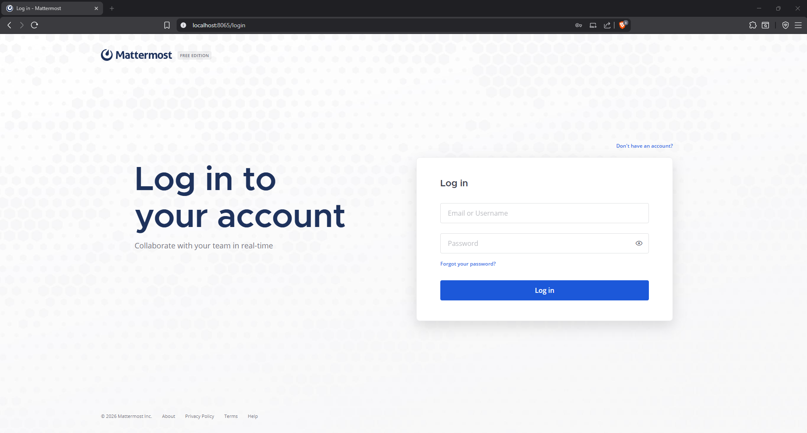
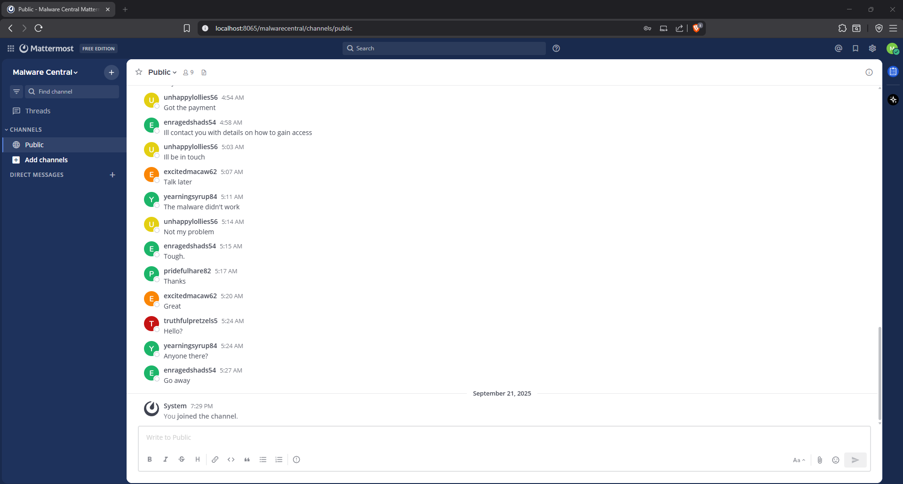
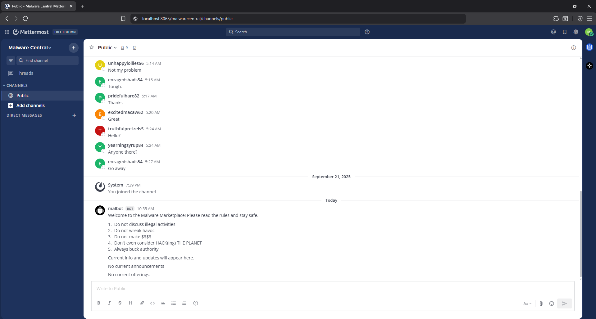
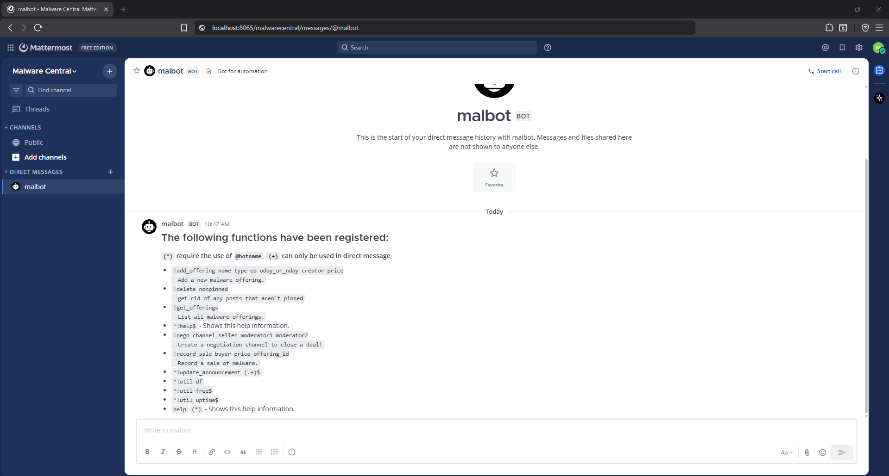
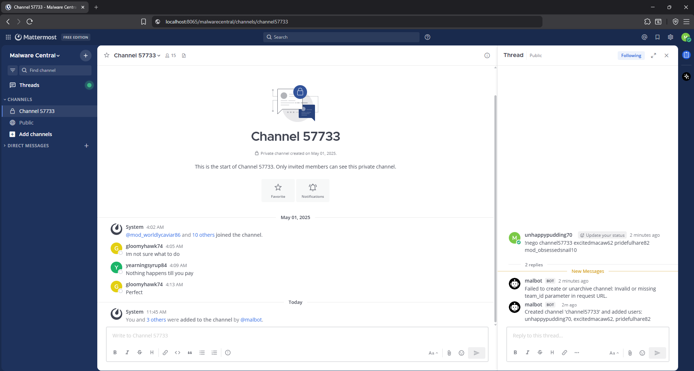
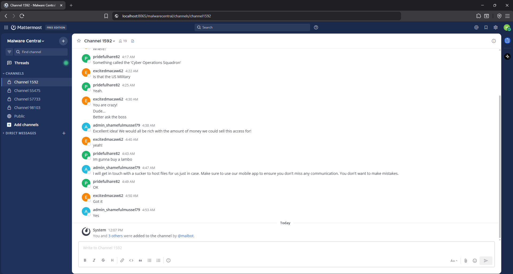

# Task 6 - Crossing the Channel - (Vulnerability Research)
## Date started: November 12, 2025
## Date completed: November 26, 2025
## Provided Materials
- Mattermost instance (volumes.tar.gz)
- User login (user.txt)
## Objective
Submit a series of commands, one per line, given to the Mattermost server which will allow you to gain access to a channel with the adversary.
## Analysis
Unlike previous tasks, Task 6 did not require reverse engineering or cryptanalysis. Instead, it focused on deploying and interacting with a provided Mattermost collaboration platform in order to identify and exploit weaknesses in its configuration and auxiliary components. As a result, this task is more operational and interaction-heavy, with progress demonstrated primarily through environment setup, configuration changes, and in-application behavior.
### Environment Overview
The provided materials consisted of a Mattermost server instance and persistent volumes containing application data. Inspection of the contents revealed:
- A Mattermost server backed by a **PostgreSQL 13** database
- A custom **Python-based Mattermost chatbot**, with unobfuscated source code included
- A single set of Mattermost user credentials, which represents the only valid login provided for the task
### Mattermost Deployment Issues
To bring the environment online, I followed Mattermost’s official Docker-based deployment [documentation](https://docs.mattermost.com/deployment-guide/server/containers/install-docker.html) and attempted to start the provided instance using the supplied volumes. The server failed to start successfully.

Reviewing the container logs revealed authentication failures between Mattermost and PostgreSQL. Specifically, the configured database user password did not match the credentials stored in the database, indicating that the database was not using Mattermost’s default credentials.
### Database Recovery and Configuration Fix
To recover access to the database:
1. PostgreSQL 13 was installed locally to match the version used by the Mattermost instance.
2. The database volume was mounted directly for inspection.
3. Because valid credentials were not available, PostgreSQL was started in **single-user mode**, allowing administrative access without authentication.
4. The password for the `mmuser` database account was reset.
5. Mattermost’s configuration files were updated to reflect the corrected database credentials.

After these changes, the Mattermost server started successfully and connected to the database without error.



### Mattermost Access and Initial Limitations
With the server operational, I logged in using the credentials provided in `user.txt`. Upon login, only a single public channel `Public` was available to chat in. No administrative permissions were granted to my account, and I could not directly join other channels.



### Chatbot Integration
Further investigation showed that the Mattermost instance integrates with a **custom Python chatbot**, which interacts with user messages and executes server-side logic. Unlike the malware analyzed in previous tasks, the source code was fully readable and not obfuscated.

After installing the necessary dependencies, I attempted to start the chatbot by running the entry script `bot.py`. The script failed with the following log:
```
[01/05/2026 10:13:12][httpx][INFO] HTTP Request: POST http://127.0.0.1:8065/api/v4/users/login "HTTP/1.1 400 Bad Request"
[01/05/2026 10:13:12][mattermostautodriver.websocket][ERROR] Password field must not be blank
```

Investigating the source code reveals that the program requires an `.env` configuration file containing the bot's Mattermost token and the team name. I located the team name `malwarecentral` within the current URL of my web browser. The instance's database stores the bot token within the table `useraccesstokens`. With the `.env` file created, the chatbot successfully connected and displayed an announcement message.



### Identifying Authorization Logic Flaws in the Chatbot
The focus shifted to analyzing the chatbot’s command-handling logic to identify input that could be abused to enumerate channels, escalate privileges, or otherwise gain access to adversary-controlled channels. When starting a direct message with the chatbot, known as `malbot`, it sends a list of all available commands.



These appear to be a mix of commands that display system uptime and disk space, manage malware offerings for sale and channel posts, or update the `malbot's` announcement message. Each command's exact logic is available in the provided source. During my review through each, I found a programming oversight in the `!nego` command, which allows users to create negotiation channels for posted offerings.

Provided below is the source for the `!nego` command. A user must provide the following arguments:
- The channel's name
- The seller's username
- Two moderator's usernames
When a user calls the command, `malbot` creates a new private channel containing that user, the seller, and the moderators. The command contains three critical vulnerabilities, which I have identified as comments within the source.
```python
# VULNERABILITY: Missing authorization check.
#
# Any authenticated user can invoke the !nego command, as no role- or permission-based
# access control is enforced before creating or modifying private channels.
@listen_to('^!nego (.*)$', no_direct=True,human_description="!nego channel seller moderator1 moderator2\n\tCreate a negotiation channel to close a deal!")
def handle_nego(self : Plugin, message: Message, *args):
	logger.debug(f"handle_nego called with message: {message.text}")
	
	# Verify command's argument count
	args = message.text.strip().split()
	if len(args) != 5:
		self.driver.reply_to(message, "Usage: !nego channel seller moderator1 moderator2")
		logger.warning("handle_nego: Incorrect number of arguments")
		return
	
	# Parse arguments
	user1 = message.sender_name
	_, channel_name, user2, user3, user4 = args[:6]
	# VULNERABILITY: Improper role verification.
	#
	# Moderator privileges are inferred from the username prefix ("mod_") rather than
	# validated against actual user permissions. Additionally, only one moderator argument (moderator2)
	# is checked, allowing arbitrary users to be assigned elevated roles.
	if not user4.startswith('mod_'):
		self.driver.reply_to(message, f"You must have a mod")
		return
	display_name = channel_name
	team_name = self.driver.options.get('team', 'malwarecentral')
	print(f"[DEBUG] Looking up team: {team_name}")
	# Get team info
	team = self.driver.teams.get_team_by_name(team_name)
	logger.debug(f"Team API response: {team}")
	team_id = team.get('id') if isinstance(team, dict) else team.json().get('id')
	print(f"[DEBUG] team_id: {team_id}")
	# Create channel
	channel_options = {
		"team_id": team_id,
		"name": channel_name,
		"display_name": display_name,
		"type": "P"
	}
	
	# VULNERABILITY: Unauthorized channel access via channel reuse.
	#
	# If a channel with the specified name already exists (including archived channels),
	# the command will unarchive it and add user-supplied members without verifying
	# whether those users were legitimate members of the target channel.
	#
	# Although all participants must already be members of the channel where !nego is invoked,
	# the reuse and unarchive behavior allows an attacker to pivot laterally into previously inaccessible
	# private channels by selecting attacker-controlled channel names.
	#
	# This authorization context confusion enables lateral movement across channels
	# and is the core primitive exploited in Task 6.
	logger.debug(f"Creating channel with options: {channel_options}")
	try:
		channel = self.driver.channels.create_channel(channel_options)
		print(f"[DEBUG] Channel API response: {channel}")
	#hide weird exception when we have an archived channel with the same name, we'll just unarchive it
	except Exception as e:
		print(f"[DEBUG] Exception while creating channel: {e}")
		# Try to unarchive the channel if it exists
		try:
			archived_channel = self.driver.channels.get_channel_by_name(channel_name, team_id)
			if archived_channel and archived_channel.get('delete_at') > 0:
				logger.info(f"Unarchiving existing channel: {archived_channel}")
				self.driver.channels.unarchive_channel(archived_channel.get('id'))
				channel = archived_channel
		except Exception as e:
			self.driver.reply_to(message, f"Failed to create or unarchive channel: {e}")
	#we either created a new channel or unarchived an existing one
	print(f"[DEBUG] getting channel: {channel_name} in team {team_id}")
	channel = self.driver.channels.get_channel_by_name(team_id, channel_name)
	channel_id = channel.get('id') if isinstance(channel, dict) else channel.json().get('id')
	print(f"[DEBUG] channel_id: {channel_id}")
	# Get user ids
	user_ids = []
	for uname in [user1, user2, user3, user4]:
		logger.debug(f"Looking up user: {uname}")
		user = self.driver.users.get_user_by_username(uname)
		logger.debug(f"User API response: {user}")
		uid = user.get('id') if isinstance(user, dict) else user.json().get('id')
		logger.debug(f"user_id for {uname}: {uid}")
		if not uid:
			self.driver.reply_to(message, f"User not found: {uname}")
			logger.warning(f"handle_nego: User not found: {uname}")
			return
		user_ids.append(uid)
	if len(set(user_ids)) != 4:
		logger.warning(f"incorrect number of users to run command")
		self.driver.reply_to(message, f"incorrect number of users to run command")
		return
	print(f"[DEBUG] All user_ids: {user_ids}")

	# Check if channel already has members
	existing_members = self.driver.channels.get_channel_members(channel_id)
	existing_member_user_ids = [member.get('user_id') for member in existing_members]
	existing_user_ids = any(uid in user_ids for uid in existing_member_user_ids)
	if existing_user_ids:
		# If the channel already has members, we should not add them again
		# This is a safeguard against creating duplicate entries in an archived channel
		print(f"[DEBUG] Existing members in channel {channel_id}: {existing_member_user_ids}, this shouldn't happen! archived channels should be empty")
		return
	# make sure not adding randos
	current_members_ids = [m['user_id'] for m in self.driver.channels.get_channel_members(message.channel_id)]
	if not (user_ids[0] in current_members_ids and user_ids[1] in current_members_ids and
			user_ids[2] in current_members_ids and user_ids[3] in current_members_ids):
		self.driver.reply_to(message, f"Could not find users")
		return

	# Add users to channel
	for uid in user_ids:
		logger.debug(f"Adding user {uid} to channel {channel_id}")
		self.driver.channels.add_channel_member(channel_id, {"user_id": uid})
	self.driver.reply_to(message, f"Created channel '{display_name}' and added users: {user1}, {user2}, {user3}")
	logger.info(f"Created channel '{display_name}' and added users: {user1}, {user2}, {user3}")
```
### The Lateral Movement Exploit
Given that I already have access to the `Public` channel in the adversary's Mattermost team, I can invoke `!nego` in a specific manner that allows me to move into another existing private channel. However, the target channel must not already contain the two users and the required moderator supplied to the command.

The username of our adversary must be `admin_shamefulmussel79`, as only this user appears to hold admin privileges. They are not a member of `Public`, so lateral movement must be performed to gain access to the right channel. By querying the Mattermost database to enumerate channels and their memberships, the adversary only appears in the channel `channel1592`. I cannot directly move there from `Public`, so the list identified the first channel to join, `Channel 57733`. The command `!nego channel57733 excitedmacaw62 pridefulhare82 mod_obsessedsnail10` succeeded, granting access to `Channel 57733`.



Because the adversary was not directly reachable from `Public`, the exploit required chaining multiple `!nego` invocations to progressively pivot into intermediary private channels until the adversary’s channel was reached. The remaining commands granted access to the target channel:
- `!nego channel98103 excitedmacaw62 gloomyhawk74 mod_grizzledfalcon11`
- `!nego channel55475 awedwhiting4 gloomyhawk74 mod_shamefulbaboon72`
- `!nego channel1592 awedwhiting4 betrayedhoopoe64 mod_grudginglemur63`



## Result
With the adversary's channel now accessible, the following sequence of `malbot` commands was submitted as the solution for Task 6:
- `!nego channel57733 excitedmacaw62 pridefulhare82 mod_obsessedsnail10` 
- `!nego channel98103 excitedmacaw62 gloomyhawk74 mod_grizzledfalcon11`
- `!nego channel55475 awedwhiting4 gloomyhawk74 mod_shamefulbaboon72`
- `!nego channel1592 awedwhiting4 betrayedhoopoe64 mod_grudginglemur63`